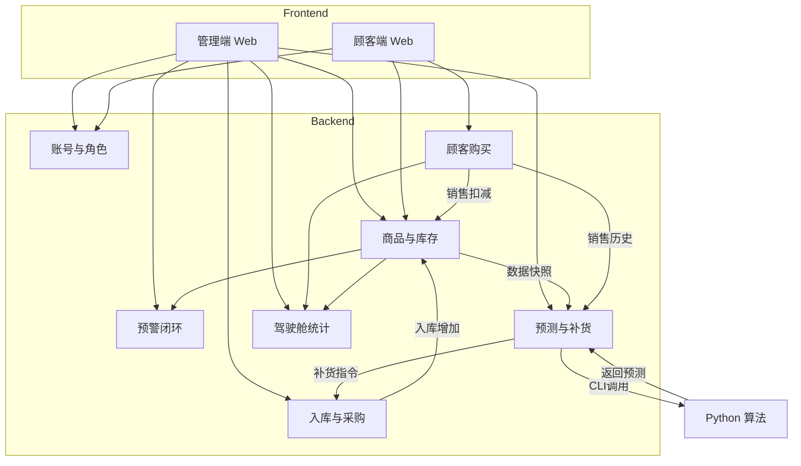

# 系统架构骨架_v1.1

> 项目：基于 Spring Boot + Vue + 时间序列分析的生鲜销售系统及智能补货系统  
> 目标：在 v1.0 基础上，去除“销售与收银”模块功能，简化业务流程，聚焦生鲜销售与智能补货。

---

## 1) 模块清单（名称 / 责任边界 / 关联角色 / 输入输出）

### A. Frontend（Vue 3 + Vite + TypeScript）

#### A1. 管理端 Web（Admin Console）
- 名称：管理端 Web（运营后台）
- 责任边界：
  - 面向系统管理员/店长/库管的统一工作台
  - 覆盖账号与权限管理、进销存操作、预警处理、补货审批、数据看板
  - 销售统计功能（原收银相关统计）收归店长驾驶舱
- 关联角色：系统管理员、店长、库管、收银（保留角色，仅限基础权限）
- 输入输出：
  - 输入：用户操作、后端业务数据、校验错误
  - 输出：业务操作请求、可视化图表与报表

#### A2. 顾客端 Web（Customer Portal）
- 名称：顾客端 Web（商城前台）
- 责任边界：
  - 面向顾客的商品浏览、购物车、下单、模拟支付、订单查询
- 关联角色：顾客
- 输入输出：
  - 输入：顾客操作、商品/订单数据、支付结果（模拟）
  - 输出：下单与支付请求

---

### B. Backend（Spring Boot + Mybatis-Plus + Security + JWT）

#### B1. 账号与角色模块（Auth & RBAC）
- 名称：账号与角色闭环
- 责任边界：
  - 账号全生命周期管理，支持多角色（店长/库管/收银/管理员/顾客）
  - 鉴权与操作审计（Audit Log）
- 关联角色：所有角色
- 输入输出：
  - 输入：登录凭证、权限校验请求
  - 输出：JWT 令牌、鉴权状态、审计事件

#### B2. 商品与库存模块（Catalog & Inventory）
- 名称：商品与库存闭环
- 责任边界：
  - 商品信息维护（SKU、单价、安全库存等）
  - 库存批次与效期管理、库存流水记录
  - 提供“可售库存”给顾客购买链路
- 关联角色：店长、库管、顾客
- 输入输出：
  - 输入：商品维护指令、入库/销售扣减结果
  - 输出：可售视图、库存变更事件、状态快照

#### B3. 入库与采购模块（Procurement & Inbound）
- 名称：入库与采购闭环
- 责任边界：
  - 执行店长审批后的补货指令
  - 库管到货验收与入库登记，生成库存批次
- 关联角色：店长、库管
- 输入输出：
  - 输入：补货指令、到货验收结果
  - 输出：入库结果、库存增加事件

#### B4. 顾客购买模块（Customer Order）
- 名称：顾客购买闭环
- 责任边界：
  - 顾客在线下单全流程（含模拟支付）
  - 协同库存模块完成订单扣减，保证交易一致性
- 关联角色：顾客、店长（查看统计）
- 输入输出：
  - 输入：下单请求、模拟支付确认
  - 输出：订单状态、库存扣减事件

#### B5. 销售与收银模块（POS & Sales） - [已关闭]
- 状态说明：**此模块功能开发已停止。**
- 保留项：保留 `CASHIER` 角色及相关库表（`sale_order`, `sale_item`），仅用于兼容历史数据或基础查询，不再增添新功能。

#### B6. 预警模块（Alerts）
- 名称：预警闭环
- 责任边界：
  - 安全库存预警（商品维度）与过期/临期预警（批次维度）
  - 预警处置流程（确认/报损/促销等）
- 关联角色：店长、库管
- 输入输出：
  - 输入：库存快照、处置操作
  - 输出：预警记录、处置归档

#### B7. 预测与智能补货模块（Forecast & Replenishment）
- 名称：预测与智能补货闭环
- 责任边界：
  - 准备销售历史数据（CSV），调用 Python 算法脚本
  - 生成建议采购单供店长审批，审批通过后联动入库模块
- 关联角色：店长、库管
- 输入输出：
  - 输入：历史销售聚合视图、当前库存、补货配置
  - 输出：预测结果、建议采购单（待审批/已通过）

#### B8. 数据可视化与驾驶舱模块（Analytics & Dashboard）
- 名称：数据可视化与驾驶舱闭环
- 责任边界：
  - 汇聚销售（含线上/历史线下）、库存、损耗、预测效果等核心指标
  - 支撑店长决策，由店长统一查看销售统计
- 关联角色：店长、系统管理员
- 输入输出：
  - 输入：各业务模块结果视图
  - 输出：图表数据集、看板面板

---

### C. Algorithm（Python 3.12 + scikit-learn）

#### C1. 时间序列预测脚本（Forecast Script）
- 名称：时间序列预测脚本
- 责任边界：接收 CSV，输出 JSON 预测结果（stdout）。
- 输入输出：CSV 路径 -> JSON (预测量/建议采购量)。

---

## 2) 简化业务流程（核心链路）

### 2.1 顾客购买与库存联动（生鲜销售）
1. **浏览与加购**：顾客浏览实时价格与可售库存 -> 加入购物车。
2. **下单与支付**：顾客下单 -> 执行“模拟支付” -> 支付成功。
3. **库存扣减**：系统自动根据“先进先出”或“近效期先出”原则扣减库存批次 -> 记录库存流水。

### 2.2 智能预测与自动补货（核心闭环）
1. **数据准备**：后端聚合历史销售数据（含线上订单及保留的线下记录） -> 导出 CSV。
2. **算法预测**：调用 Python 脚本 -> 获取 $Q_{predict}$。
3. **补货生成**：根据公式 $Q_{suggest} = Q_{predict} \times T_{cycle} + S_{safety} - I_{current}$ 生成建议单。
4. **审批执行**：店长审批 -> 库管执行入库 -> 库存增加。

### 2.3 质量与预警管理
1. **状态监控**：系统定时扫描库存批次效期与安全库存水位。
2. **预警触发**：触发临期/低库存预警 -> 推送至店长/库管工作台。
3. **处置反馈**：库管执行报损/促销 -> 更新库存状态。

---

## 3) 模块关系图 (Mermaid)

---

## 4) 冻结声明
1. **功能去重**：不再开发 POS 收银界面，所有销售业务集中于顾客端 Web。
2. **角色保留**：`CASHIER` 角色保留，库表保留，用于统计兼容。
3. **统计归口**：所有销售统计、趋势分析均归口至“店长”角色的驾驶舱模块。
4. **最小变更**：非必要不修改现有库表结构，仅在逻辑层关闭 B5 模块入口。
