# 数据模型骨架（ER + 核心 DDL）

> 数据库：MySQL 8.2  
> DB：freshmart_irs  
> 主键策略冻结：所有 PK 为 BIGINT UNSIGNED AUTO_INCREMENT；所有 FK 为 BIGINT UNSIGNED

---

## 1) ER 图（Mermaid erDiagram）

```mermaid
erDiagram
  user ||--o{ user_role : assigns
  role ||--o{ user_role : assigned

  user ||--o{ cart : owns
  cart ||--o{ cart_item : contains
  product ||--o{ cart_item : added

  user ||--o{ customer_order : places
  customer_order ||--o{ customer_order_item : contains
  product ||--o{ customer_order_item : ordered
  inventory_batch ||--o{ customer_order_item : allocated
  customer_order ||--o| payment : paid_by

  user ||--o{ sale_order : creates
  sale_order ||--o{ sale_item : contains
  product ||--o{ sale_item : sold
  inventory_batch ||--o{ sale_item : deducted_from

  user ||--o{ stock_in_order : creates
  stock_in_order ||--o{ stock_in_item : contains
  product ||--o{ stock_in_item : received
  inventory_batch ||--o{ stock_in_item : creates_batch

  product ||--o{ inventory_batch : has
  product ||--o{ inventory_ledger : affects
  inventory_batch ||--o{ inventory_ledger : traces

  product ||--o{ alert : triggers
  inventory_batch ||--o{ alert : triggers_batch
  alert ||--o{ alert_action : has_actions
  user ||--o{ alert_action : performs

  user ||--o{ replenishment_suggestion : approves
  replenishment_suggestion ||--o{ replenishment_item : has_items
  product ||--o{ replenishment_item : suggests

  user {
    BIGINT id PK
    VARCHAR username
    VARCHAR password_hash
    VARCHAR phone
    VARCHAR email
    TINYINT status
    DATETIME created_at
    DATETIME updated_at
  }

  role {
    BIGINT id PK
    VARCHAR code
    VARCHAR name
    TINYINT status
    DATETIME created_at
    DATETIME updated_at
  }

  user_role {
    BIGINT id PK
    BIGINT user_id FK
    BIGINT role_id FK
    DATETIME created_at
    DATETIME updated_at
  }

  product {
    BIGINT id PK
    VARCHAR sku
    VARCHAR name
    VARCHAR unit
    DECIMAL price
    INT safety_stock_qty
    TINYINT status
    DATETIME created_at
    DATETIME updated_at
  }

  inventory_batch {
    BIGINT id PK
    BIGINT product_id FK
    VARCHAR batch_no
    DATE production_date
    DATE expiry_date
    INT qty_initial
    INT qty_available
    TINYINT status
    DATETIME received_at
    DATETIME created_at
    DATETIME updated_at
  }

  inventory_ledger {
    BIGINT id PK
    BIGINT product_id FK
    BIGINT inventory_batch_id FK
    VARCHAR change_type
    INT change_qty
    INT qty_after
    VARCHAR source_type
    BIGINT source_id
    DATETIME event_time
    DATETIME created_at
    DATETIME updated_at
  }

  stock_in_order {
    BIGINT id PK
    VARCHAR biz_no
    BIGINT created_by FK
    VARCHAR status
    DATETIME received_at
    VARCHAR remark
    DATETIME created_at
    DATETIME updated_at
  }

  stock_in_item {
    BIGINT id PK
    BIGINT stock_in_order_id FK
    BIGINT product_id FK
    BIGINT inventory_batch_id FK
    INT qty
    DECIMAL unit_cost
    DATE production_date
    DATE expiry_date
    DATETIME created_at
    DATETIME updated_at
  }

  sale_order {
    BIGINT id PK
    VARCHAR biz_no
    BIGINT cashier_id FK
    VARCHAR status
    DECIMAL total_amount
    DATETIME sale_time
    DATETIME created_at
    DATETIME updated_at
  }

  sale_item {
    BIGINT id PK
    BIGINT sale_order_id FK
    BIGINT product_id FK
    BIGINT inventory_batch_id FK
    INT qty
    DECIMAL unit_price
    DECIMAL line_amount
    DATETIME created_at
    DATETIME updated_at
  }

  cart {
    BIGINT id PK
    BIGINT user_id FK
    VARCHAR status
    DATETIME created_at
    DATETIME updated_at
  }

  cart_item {
    BIGINT id PK
    BIGINT cart_id FK
    BIGINT product_id FK
    INT qty
    DATETIME created_at
    DATETIME updated_at
  }

  customer_order {
    BIGINT id PK
    VARCHAR biz_no
    BIGINT user_id FK
    VARCHAR order_status
    DECIMAL total_amount
    DATETIME placed_at
    DATETIME confirmed_at
    DATETIME cancelled_at
    DATETIME created_at
    DATETIME updated_at
  }

  customer_order_item {
    BIGINT id PK
    BIGINT customer_order_id FK
    BIGINT product_id FK
    BIGINT inventory_batch_id FK
    INT qty
    DECIMAL unit_price
    DECIMAL line_amount
    DATETIME created_at
    DATETIME updated_at
  }

  payment {
    BIGINT id PK
    BIGINT customer_order_id FK
    VARCHAR pay_status
    DECIMAL amount
    DATETIME paid_at
    VARCHAR pay_ref
    DATETIME created_at
    DATETIME updated_at
  }

  alert {
    BIGINT id PK
    VARCHAR alert_type
    VARCHAR alert_status
    BIGINT product_id FK
    BIGINT inventory_batch_id FK
    INT threshold_qty
    DATE expiry_date
    DATETIME triggered_at
    DATETIME resolved_at
    DATETIME created_at
    DATETIME updated_at
  }

  alert_action {
    BIGINT id PK
    BIGINT alert_id FK
    BIGINT actor_user_id FK
    VARCHAR action_type
    VARCHAR action_result
    DATETIME action_time
    DATETIME created_at
    DATETIME updated_at
  }

  replenishment_suggestion {
    BIGINT id PK
    VARCHAR biz_no
    VARCHAR approval_status
    BIGINT approved_by FK
    DATETIME approved_at
    VARCHAR reject_reason
    DATETIME generated_at
    DATETIME created_at
    DATETIME updated_at
  }

  replenishment_item {
    BIGINT id PK
    BIGINT replenishment_suggestion_id FK
    BIGINT product_id FK
    INT predicted_qty
    INT cycle_days
    INT safety_stock_qty
    INT current_stock_qty
    INT suggested_qty
    DATETIME created_at
    DATETIME updated_at
  }
```



---

## 2) 状态枚举值清单（冻结语义）

### 2.1 通用状态
- `user.status`：`1=ACTIVE`（可用），`0=DISABLED`（禁用）
- `role.status`：`1=ACTIVE`（可用），`0=DISABLED`（禁用）
- `product.status`：`1=ON_SALE`（上架可售），`0=OFF_SALE`（下架不可售）
- `inventory_batch.status`：`1=AVAILABLE`（可用且未过期），`0=BLOCKED`（冻结不可用），`2=EXPIRED`（已过期不可售）

### 2.2 入库单状态（`stock_in_order.status`）
- `DRAFT`：草稿（未提交入库）
- `CONFIRMED`：已确认（入库完成，库存与流水已落库）
- `CANCELLED`：已取消（不再允许入库）

### 2.3 销售单状态（`sale_order.status`）
- `COMPLETED`：已完成（扣减库存与流水已落库）
- `CANCELLED`：已取消（不扣减库存）

### 2.4 购物车状态（`cart.status`）
- `ACTIVE`：使用中（可继续加购/修改数量）
- `CHECKED_OUT`：已结算（已生成订单，可作为历史快照）

### 2.5 顾客订单状态（`customer_order.order_status`）
- `PLACED`：已下单（订单已生成，未支付）
- `PAID`：已支付（已记录模拟支付）
- `CONFIRMED`：已确认（订单确认完成，库存扣减与流水已落库）
- `CANCELLED`：已取消（不再推进状态；是否已支付由支付记录决定）

### 2.6 模拟支付状态（`payment.pay_status`）
- `INIT`：初始化（支付记录已创建）
- `SUCCESS`：支付成功（驱动订单可进入 PAID）
- `FAILED`：支付失败（不驱动订单进入 PAID）

### 2.7 库存流水类型（`inventory_ledger.change_type`）
- `STOCK_IN`：入库增加
- `SALE_POS`：收银销售扣减
- `SALE_ONLINE`：顾客订单扣减
- `ADJUST`：库存调整（盘点差异等）

### 2.8 预警类型与状态
- `alert.alert_type`：
  - `LOW_STOCK`：安全库存预警（商品维度）
  - `NEAR_EXPIRY`：临期预警（批次维度）
  - `EXPIRED`：过期预警（批次维度）
- `alert.alert_status`：
  - `OPEN`：已触发待处理
  - `ACKED`：已确认处理中
  - `RESOLVED`：已解决（已采取处置动作）
  - `CLOSED`：已关闭归档（不再处理）
- `alert_action.action_type`：
  - `ACK`：确认受理
  - `DISPOSE`：报损/销毁
  - `PROMOTE`：促销处理
  - `RETURN`：退货处理
  - `OTHER`：其他

### 2.9 补货建议审批状态（`replenishment_suggestion.approval_status`）
- `PENDING`：待审批（店长未处理）
- `APPROVED`：已通过（库管可执行采购入库）
- `REJECTED`：已驳回（本次建议不执行）

---

## 3) 核心 DDL（MySQL 8.2，freshmart_irs）

```sql
CREATE DATABASE IF NOT EXISTS freshmart_irs
  DEFAULT CHARACTER SET utf8mb4
  DEFAULT COLLATE utf8mb4_0900_ai_ci;

USE freshmart_irs;

SET NAMES utf8mb4;

-- 1) 账号与角色
CREATE TABLE IF NOT EXISTS `user` (
  `id` BIGINT UNSIGNED NOT NULL AUTO_INCREMENT COMMENT 'PK',
  `username` VARCHAR(64) NOT NULL COMMENT '登录名（唯一）',
  `password_hash` VARCHAR(255) NOT NULL COMMENT '密码哈希',
  `phone` VARCHAR(32) NULL COMMENT '手机号',
  `email` VARCHAR(128) NULL COMMENT '邮箱',
  `status` TINYINT NOT NULL DEFAULT 1 COMMENT '用户状态：1=ACTIVE,0=DISABLED',
  `created_at` DATETIME NOT NULL DEFAULT CURRENT_TIMESTAMP COMMENT '创建时间',
  `updated_at` DATETIME NOT NULL DEFAULT CURRENT_TIMESTAMP ON UPDATE CURRENT_TIMESTAMP COMMENT '更新时间',
  PRIMARY KEY (`id`),
  UNIQUE KEY `uk_user_username` (`username`),
  KEY `idx_user_status` (`status`)
) ENGINE=InnoDB DEFAULT CHARSET=utf8mb4 COLLATE=utf8mb4_0900_ai_ci COMMENT='统一用户表（员工+顾客）';

CREATE TABLE IF NOT EXISTS `role` (
  `id` BIGINT UNSIGNED NOT NULL AUTO_INCREMENT COMMENT 'PK',
  `code` VARCHAR(64) NOT NULL COMMENT '角色编码（唯一，如 ADMIN/STORE_MANAGER/WAREHOUSE/CASHIER/CUSTOMER）',
  `name` VARCHAR(64) NOT NULL COMMENT '角色名称',
  `status` TINYINT NOT NULL DEFAULT 1 COMMENT '角色状态：1=ACTIVE,0=DISABLED',
  `created_at` DATETIME NOT NULL DEFAULT CURRENT_TIMESTAMP COMMENT '创建时间',
  `updated_at` DATETIME NOT NULL DEFAULT CURRENT_TIMESTAMP ON UPDATE CURRENT_TIMESTAMP COMMENT '更新时间',
  PRIMARY KEY (`id`),
  UNIQUE KEY `uk_role_code` (`code`),
  KEY `idx_role_status` (`status`)
) ENGINE=InnoDB DEFAULT CHARSET=utf8mb4 COLLATE=utf8mb4_0900_ai_ci COMMENT='角色表（含 CUSTOMER）';

CREATE TABLE IF NOT EXISTS `user_role` (
  `id` BIGINT UNSIGNED NOT NULL AUTO_INCREMENT COMMENT 'PK',
  `user_id` BIGINT UNSIGNED NOT NULL COMMENT 'FK -> user.id',
  `role_id` BIGINT UNSIGNED NOT NULL COMMENT 'FK -> role.id',
  `created_at` DATETIME NOT NULL DEFAULT CURRENT_TIMESTAMP COMMENT '创建时间',
  `updated_at` DATETIME NOT NULL DEFAULT CURRENT_TIMESTAMP ON UPDATE CURRENT_TIMESTAMP COMMENT '更新时间',
  PRIMARY KEY (`id`),
  UNIQUE KEY `uk_user_role_user_role` (`user_id`, `role_id`),
  KEY `idx_user_role_user_id` (`user_id`),
  KEY `idx_user_role_role_id` (`role_id`),
  CONSTRAINT `fk_user_role_user` FOREIGN KEY (`user_id`) REFERENCES `user` (`id`) ON UPDATE CASCADE ON DELETE RESTRICT,
  CONSTRAINT `fk_user_role_role` FOREIGN KEY (`role_id`) REFERENCES `role` (`id`) ON UPDATE CASCADE ON DELETE RESTRICT
) ENGINE=InnoDB DEFAULT CHARSET=utf8mb4 COLLATE=utf8mb4_0900_ai_ci COMMENT='用户-角色绑定（权限/菜单层面）';

-- 2) 商品与库存
CREATE TABLE IF NOT EXISTS `product` (
  `id` BIGINT UNSIGNED NOT NULL AUTO_INCREMENT COMMENT 'PK',
  `sku` VARCHAR(64) NOT NULL COMMENT 'SKU（唯一）',
  `name` VARCHAR(128) NOT NULL COMMENT '商品名称',
  `unit` VARCHAR(32) NOT NULL COMMENT '计量单位（如 kg/盒/袋）',
  `price` DECIMAL(10,2) NOT NULL DEFAULT 0.00 COMMENT '单价（销售价）',
  `safety_stock_qty` INT NOT NULL DEFAULT 0 COMMENT '安全库存阈值（触发LOW_STOCK）',
  `status` TINYINT NOT NULL DEFAULT 1 COMMENT '商品状态：1=ON_SALE,0=OFF_SALE',
  `created_at` DATETIME NOT NULL DEFAULT CURRENT_TIMESTAMP COMMENT '创建时间',
  `updated_at` DATETIME NOT NULL DEFAULT CURRENT_TIMESTAMP ON UPDATE CURRENT_TIMESTAMP COMMENT '更新时间',
  PRIMARY KEY (`id`),
  UNIQUE KEY `uk_product_sku` (`sku`),
  KEY `idx_product_status` (`status`),
  KEY `idx_product_name` (`name`)
) ENGINE=InnoDB DEFAULT CHARSET=utf8mb4 COLLATE=utf8mb4_0900_ai_ci COMMENT='商品表';

CREATE TABLE IF NOT EXISTS `inventory_batch` (
  `id` BIGINT UNSIGNED NOT NULL AUTO_INCREMENT COMMENT 'PK',
  `product_id` BIGINT UNSIGNED NOT NULL COMMENT 'FK -> product.id',
  `batch_no` VARCHAR(64) NOT NULL COMMENT '入库批次号（业务号，可用于追溯）',
  `production_date` DATE NULL COMMENT '生产日期（可空）',
  `expiry_date` DATE NOT NULL COMMENT '效期日期',
  `qty_initial` INT NOT NULL COMMENT '批次初始入库数量',
  `qty_available` INT NOT NULL COMMENT '批次当前可用数量',
  `status` TINYINT NOT NULL DEFAULT 1 COMMENT '批次状态：1=AVAILABLE,0=BLOCKED,2=EXPIRED',
  `received_at` DATETIME NOT NULL COMMENT '入库时间',
  `created_at` DATETIME NOT NULL DEFAULT CURRENT_TIMESTAMP COMMENT '创建时间',
  `updated_at` DATETIME NOT NULL DEFAULT CURRENT_TIMESTAMP ON UPDATE CURRENT_TIMESTAMP COMMENT '更新时间',
  PRIMARY KEY (`id`),
  UNIQUE KEY `uk_inventory_batch_product_batchno` (`product_id`, `batch_no`),
  KEY `idx_inventory_batch_product_id` (`product_id`),
  KEY `idx_inventory_batch_expiry_date` (`expiry_date`),
  KEY `idx_inventory_batch_status` (`status`),
  CONSTRAINT `fk_inventory_batch_product` FOREIGN KEY (`product_id`) REFERENCES `product` (`id`) ON UPDATE CASCADE ON DELETE RESTRICT
) ENGINE=InnoDB DEFAULT CHARSET=utf8mb4 COLLATE=utf8mb4_0900_ai_ci COMMENT='库存批次（含效期）';

CREATE TABLE IF NOT EXISTS `inventory_ledger` (
  `id` BIGINT UNSIGNED NOT NULL AUTO_INCREMENT COMMENT 'PK',
  `product_id` BIGINT UNSIGNED NOT NULL COMMENT 'FK -> product.id',
  `inventory_batch_id` BIGINT UNSIGNED NOT NULL COMMENT 'FK -> inventory_batch.id（批次追溯必填）',
  `change_type` VARCHAR(32) NOT NULL COMMENT '流水类型：STOCK_IN/SALE_POS/SALE_ONLINE/ADJUST',
  `change_qty` INT NOT NULL COMMENT '变更数量（入库为正，扣减为负）',
  `qty_after` INT NOT NULL COMMENT '变更后批次可用量快照',
  `source_type` VARCHAR(32) NOT NULL COMMENT '来源单据类型：STOCK_IN_ITEM/SALE_ITEM/CUSTOMER_ORDER_ITEM/OTHER',
  `source_id` BIGINT UNSIGNED NOT NULL COMMENT '来源单据ID（与source_type配合追溯）',
  `event_time` DATETIME NOT NULL COMMENT '业务发生时间',
  `created_at` DATETIME NOT NULL DEFAULT CURRENT_TIMESTAMP COMMENT '创建时间',
  `updated_at` DATETIME NOT NULL DEFAULT CURRENT_TIMESTAMP ON UPDATE CURRENT_TIMESTAMP COMMENT '更新时间',
  PRIMARY KEY (`id`),
  KEY `idx_inventory_ledger_product_id` (`product_id`),
  KEY `idx_inventory_ledger_batch_id` (`inventory_batch_id`),
  KEY `idx_inventory_ledger_change_type` (`change_type`),
  KEY `idx_inventory_ledger_event_time` (`event_time`),
  KEY `idx_inventory_ledger_source` (`source_type`, `source_id`),
  CONSTRAINT `fk_inventory_ledger_product` FOREIGN KEY (`product_id`) REFERENCES `product` (`id`) ON UPDATE CASCADE ON DELETE RESTRICT,
  CONSTRAINT `fk_inventory_ledger_batch` FOREIGN KEY (`inventory_batch_id`) REFERENCES `inventory_batch` (`id`) ON UPDATE CASCADE ON DELETE RESTRICT
) ENGINE=InnoDB DEFAULT CHARSET=utf8mb4 COLLATE=utf8mb4_0900_ai_ci COMMENT='库存流水（批次可追溯）';

-- 3) 入库链路
CREATE TABLE IF NOT EXISTS `stock_in_order` (
  `id` BIGINT UNSIGNED NOT NULL AUTO_INCREMENT COMMENT 'PK',
  `biz_no` VARCHAR(64) NOT NULL COMMENT '入库单号（业务号）',
  `created_by` BIGINT UNSIGNED NOT NULL COMMENT '创建人（库管/店长）FK -> user.id',
  `status` VARCHAR(16) NOT NULL DEFAULT 'DRAFT' COMMENT 'DRAFT/CONFIRMED/CANCELLED',
  `received_at` DATETIME NULL COMMENT '到货/入库确认时间',
  `remark` VARCHAR(255) NULL COMMENT '备注',
  `created_at` DATETIME NOT NULL DEFAULT CURRENT_TIMESTAMP COMMENT '创建时间',
  `updated_at` DATETIME NOT NULL DEFAULT CURRENT_TIMESTAMP ON UPDATE CURRENT_TIMESTAMP COMMENT '更新时间',
  PRIMARY KEY (`id`),
  UNIQUE KEY `uk_stock_in_order_biz_no` (`biz_no`),
  KEY `idx_stock_in_order_created_by` (`created_by`),
  KEY `idx_stock_in_order_status` (`status`),
  KEY `idx_stock_in_order_received_at` (`received_at`),
  CONSTRAINT `fk_stock_in_order_created_by` FOREIGN KEY (`created_by`) REFERENCES `user` (`id`) ON UPDATE CASCADE ON DELETE RESTRICT
) ENGINE=InnoDB DEFAULT CHARSET=utf8mb4 COLLATE=utf8mb4_0900_ai_ci COMMENT='入库单';

CREATE TABLE IF NOT EXISTS `stock_in_item` (
  `id` BIGINT UNSIGNED NOT NULL AUTO_INCREMENT COMMENT 'PK',
  `stock_in_order_id` BIGINT UNSIGNED NOT NULL COMMENT 'FK -> stock_in_order.id',
  `product_id` BIGINT UNSIGNED NOT NULL COMMENT 'FK -> product.id',
  `inventory_batch_id` BIGINT UNSIGNED NOT NULL COMMENT 'FK -> inventory_batch.id（对应入库生成的批次）',
  `qty` INT NOT NULL COMMENT '入库数量',
  `unit_cost` DECIMAL(10,2) NOT NULL DEFAULT 0.00 COMMENT '入库成本单价（可选业务视图）',
  `production_date` DATE NULL COMMENT '生产日期（可空）',
  `expiry_date` DATE NOT NULL COMMENT '效期日期',
  `created_at` DATETIME NOT NULL DEFAULT CURRENT_TIMESTAMP COMMENT '创建时间',
  `updated_at` DATETIME NOT NULL DEFAULT CURRENT_TIMESTAMP ON UPDATE CURRENT_TIMESTAMP COMMENT '更新时间',
  PRIMARY KEY (`id`),
  KEY `idx_stock_in_item_order_id` (`stock_in_order_id`),
  KEY `idx_stock_in_item_product_id` (`product_id`),
  KEY `idx_stock_in_item_batch_id` (`inventory_batch_id`),
  CONSTRAINT `fk_stock_in_item_order` FOREIGN KEY (`stock_in_order_id`) REFERENCES `stock_in_order` (`id`) ON UPDATE CASCADE ON DELETE RESTRICT,
  CONSTRAINT `fk_stock_in_item_product` FOREIGN KEY (`product_id`) REFERENCES `product` (`id`) ON UPDATE CASCADE ON DELETE RESTRICT,
  CONSTRAINT `fk_stock_in_item_batch` FOREIGN KEY (`inventory_batch_id`) REFERENCES `inventory_batch` (`id`) ON UPDATE CASCADE ON DELETE RESTRICT
) ENGINE=InnoDB DEFAULT CHARSET=utf8mb4 COLLATE=utf8mb4_0900_ai_ci COMMENT='入库明细';

-- 4) 销售与收银链路
CREATE TABLE IF NOT EXISTS `sale_order` (
  `id` BIGINT UNSIGNED NOT NULL AUTO_INCREMENT COMMENT 'PK',
  `biz_no` VARCHAR(64) NOT NULL COMMENT '销售单号（业务号）',
  `cashier_id` BIGINT UNSIGNED NOT NULL COMMENT '收银员 FK -> user.id',
  `status` VARCHAR(16) NOT NULL DEFAULT 'COMPLETED' COMMENT 'COMPLETED/CANCELLED',
  `total_amount` DECIMAL(12,2) NOT NULL DEFAULT 0.00 COMMENT '销售总金额',
  `sale_time` DATETIME NOT NULL COMMENT '销售发生时间',
  `created_at` DATETIME NOT NULL DEFAULT CURRENT_TIMESTAMP COMMENT '创建时间',
  `updated_at` DATETIME NOT NULL DEFAULT CURRENT_TIMESTAMP ON UPDATE CURRENT_TIMESTAMP COMMENT '更新时间',
  PRIMARY KEY (`id`),
  UNIQUE KEY `uk_sale_order_biz_no` (`biz_no`),
  KEY `idx_sale_order_cashier_id` (`cashier_id`),
  KEY `idx_sale_order_status` (`status`),
  KEY `idx_sale_order_sale_time` (`sale_time`),
  CONSTRAINT `fk_sale_order_cashier` FOREIGN KEY (`cashier_id`) REFERENCES `user` (`id`) ON UPDATE CASCADE ON DELETE RESTRICT
) ENGINE=InnoDB DEFAULT CHARSET=utf8mb4 COLLATE=utf8mb4_0900_ai_ci COMMENT='销售单（收银）';

CREATE TABLE IF NOT EXISTS `sale_item` (
  `id` BIGINT UNSIGNED NOT NULL AUTO_INCREMENT COMMENT 'PK',
  `sale_order_id` BIGINT UNSIGNED NOT NULL COMMENT 'FK -> sale_order.id',
  `product_id` BIGINT UNSIGNED NOT NULL COMMENT 'FK -> product.id',
  `inventory_batch_id` BIGINT UNSIGNED NOT NULL COMMENT 'FK -> inventory_batch.id（扣减批次）',
  `qty` INT NOT NULL COMMENT '销售数量',
  `unit_price` DECIMAL(10,2) NOT NULL DEFAULT 0.00 COMMENT '成交单价',
  `line_amount` DECIMAL(12,2) NOT NULL DEFAULT 0.00 COMMENT '行金额=qty*unit_price',
  `created_at` DATETIME NOT NULL DEFAULT CURRENT_TIMESTAMP COMMENT '创建时间',
  `updated_at` DATETIME NOT NULL DEFAULT CURRENT_TIMESTAMP ON UPDATE CURRENT_TIMESTAMP COMMENT '更新时间',
  PRIMARY KEY (`id`),
  KEY `idx_sale_item_order_id` (`sale_order_id`),
  KEY `idx_sale_item_product_id` (`product_id`),
  KEY `idx_sale_item_batch_id` (`inventory_batch_id`),
  CONSTRAINT `fk_sale_item_order` FOREIGN KEY (`sale_order_id`) REFERENCES `sale_order` (`id`) ON UPDATE CASCADE ON DELETE RESTRICT,
  CONSTRAINT `fk_sale_item_product` FOREIGN KEY (`product_id`) REFERENCES `product` (`id`) ON UPDATE CASCADE ON DELETE RESTRICT,
  CONSTRAINT `fk_sale_item_batch` FOREIGN KEY (`inventory_batch_id`) REFERENCES `inventory_batch` (`id`) ON UPDATE CASCADE ON DELETE RESTRICT
) ENGINE=InnoDB DEFAULT CHARSET=utf8mb4 COLLATE=utf8mb4_0900_ai_ci COMMENT='销售明细（收银）';

-- 5) 顾客购买链路（含模拟支付）
CREATE TABLE IF NOT EXISTS `cart` (
  `id` BIGINT UNSIGNED NOT NULL AUTO_INCREMENT COMMENT 'PK',
  `user_id` BIGINT UNSIGNED NOT NULL COMMENT '顾客 FK -> user.id',
  `status` VARCHAR(16) NOT NULL DEFAULT 'ACTIVE' COMMENT 'ACTIVE/CHECKED_OUT',
  `created_at` DATETIME NOT NULL DEFAULT CURRENT_TIMESTAMP COMMENT '创建时间',
  `updated_at` DATETIME NOT NULL DEFAULT CURRENT_TIMESTAMP ON UPDATE CURRENT_TIMESTAMP COMMENT '更新时间',
  PRIMARY KEY (`id`),
  UNIQUE KEY `uk_cart_user_id` (`user_id`),
  KEY `idx_cart_status` (`status`),
  CONSTRAINT `fk_cart_user` FOREIGN KEY (`user_id`) REFERENCES `user` (`id`) ON UPDATE CASCADE ON DELETE RESTRICT
) ENGINE=InnoDB DEFAULT CHARSET=utf8mb4 COLLATE=utf8mb4_0900_ai_ci COMMENT='购物车（每用户一车）';

CREATE TABLE IF NOT EXISTS `cart_item` (
  `id` BIGINT UNSIGNED NOT NULL AUTO_INCREMENT COMMENT 'PK',
  `cart_id` BIGINT UNSIGNED NOT NULL COMMENT 'FK -> cart.id',
  `product_id` BIGINT UNSIGNED NOT NULL COMMENT 'FK -> product.id',
  `qty` INT NOT NULL COMMENT '数量',
  `created_at` DATETIME NOT NULL DEFAULT CURRENT_TIMESTAMP COMMENT '创建时间',
  `updated_at` DATETIME NOT NULL DEFAULT CURRENT_TIMESTAMP ON UPDATE CURRENT_TIMESTAMP COMMENT '更新时间',
  PRIMARY KEY (`id`),
  UNIQUE KEY `uk_cart_item_cart_product` (`cart_id`, `product_id`),
  KEY `idx_cart_item_cart_id` (`cart_id`),
  KEY `idx_cart_item_product_id` (`product_id`),
  CONSTRAINT `fk_cart_item_cart` FOREIGN KEY (`cart_id`) REFERENCES `cart` (`id`) ON UPDATE CASCADE ON DELETE RESTRICT,
  CONSTRAINT `fk_cart_item_product` FOREIGN KEY (`product_id`) REFERENCES `product` (`id`) ON UPDATE CASCADE ON DELETE RESTRICT
) ENGINE=InnoDB DEFAULT CHARSET=utf8mb4 COLLATE=utf8mb4_0900_ai_ci COMMENT='购物车明细';

CREATE TABLE IF NOT EXISTS `customer_order` (
  `id` BIGINT UNSIGNED NOT NULL AUTO_INCREMENT COMMENT 'PK',
  `biz_no` VARCHAR(64) NOT NULL COMMENT '订单号（业务号）',
  `user_id` BIGINT UNSIGNED NOT NULL COMMENT '顾客 FK -> user.id',
  `order_status` VARCHAR(16) NOT NULL DEFAULT 'PLACED' COMMENT 'PLACED/PAID/CONFIRMED/CANCELLED',
  `total_amount` DECIMAL(12,2) NOT NULL DEFAULT 0.00 COMMENT '订单总金额',
  `placed_at` DATETIME NOT NULL COMMENT '下单时间',
  `confirmed_at` DATETIME NULL COMMENT '确认完成时间（扣减库存后）',
  `cancelled_at` DATETIME NULL COMMENT '取消时间',
  `created_at` DATETIME NOT NULL DEFAULT CURRENT_TIMESTAMP COMMENT '创建时间',
  `updated_at` DATETIME NOT NULL DEFAULT CURRENT_TIMESTAMP ON UPDATE CURRENT_TIMESTAMP COMMENT '更新时间',
  PRIMARY KEY (`id`),
  UNIQUE KEY `uk_customer_order_biz_no` (`biz_no`),
  KEY `idx_customer_order_user_id` (`user_id`),
  KEY `idx_customer_order_status` (`order_status`),
  KEY `idx_customer_order_placed_at` (`placed_at`),
  CONSTRAINT `fk_customer_order_user` FOREIGN KEY (`user_id`) REFERENCES `user` (`id`) ON UPDATE CASCADE ON DELETE RESTRICT
) ENGINE=InnoDB DEFAULT CHARSET=utf8mb4 COLLATE=utf8mb4_0900_ai_ci COMMENT='顾客订单';

CREATE TABLE IF NOT EXISTS `customer_order_item` (
  `id` BIGINT UNSIGNED NOT NULL AUTO_INCREMENT COMMENT 'PK',
  `customer_order_id` BIGINT UNSIGNED NOT NULL COMMENT 'FK -> customer_order.id',
  `product_id` BIGINT UNSIGNED NOT NULL COMMENT 'FK -> product.id',
  `inventory_batch_id` BIGINT UNSIGNED NOT NULL COMMENT 'FK -> inventory_batch.id（扣减批次）',
  `qty` INT NOT NULL COMMENT '数量',
  `unit_price` DECIMAL(10,2) NOT NULL DEFAULT 0.00 COMMENT '成交单价',
  `line_amount` DECIMAL(12,2) NOT NULL DEFAULT 0.00 COMMENT '行金额=qty*unit_price',
  `created_at` DATETIME NOT NULL DEFAULT CURRENT_TIMESTAMP COMMENT '创建时间',
  `updated_at` DATETIME NOT NULL DEFAULT CURRENT_TIMESTAMP ON UPDATE CURRENT_TIMESTAMP COMMENT '更新时间',
  PRIMARY KEY (`id`),
  KEY `idx_customer_order_item_order_id` (`customer_order_id`),
  KEY `idx_customer_order_item_product_id` (`product_id`),
  KEY `idx_customer_order_item_batch_id` (`inventory_batch_id`),
  CONSTRAINT `fk_customer_order_item_order` FOREIGN KEY (`customer_order_id`) REFERENCES `customer_order` (`id`) ON UPDATE CASCADE ON DELETE RESTRICT,
  CONSTRAINT `fk_customer_order_item_product` FOREIGN KEY (`product_id`) REFERENCES `product` (`id`) ON UPDATE CASCADE ON DELETE RESTRICT,
  CONSTRAINT `fk_customer_order_item_batch` FOREIGN KEY (`inventory_batch_id`) REFERENCES `inventory_batch` (`id`) ON UPDATE CASCADE ON DELETE RESTRICT
) ENGINE=InnoDB DEFAULT CHARSET=utf8mb4 COLLATE=utf8mb4_0900_ai_ci COMMENT='顾客订单明细（批次可追溯）';

CREATE TABLE IF NOT EXISTS `payment` (
  `id` BIGINT UNSIGNED NOT NULL AUTO_INCREMENT COMMENT 'PK',
  `customer_order_id` BIGINT UNSIGNED NOT NULL COMMENT 'FK -> customer_order.id',
  `pay_status` VARCHAR(16) NOT NULL DEFAULT 'INIT' COMMENT 'INIT/SUCCESS/FAILED',
  `amount` DECIMAL(12,2) NOT NULL DEFAULT 0.00 COMMENT '支付金额',
  `paid_at` DATETIME NULL COMMENT '支付完成时间（模拟）',
  `pay_ref` VARCHAR(64) NULL COMMENT '模拟支付参考号（可选）',
  `created_at` DATETIME NOT NULL DEFAULT CURRENT_TIMESTAMP COMMENT '创建时间',
  `updated_at` DATETIME NOT NULL DEFAULT CURRENT_TIMESTAMP ON UPDATE CURRENT_TIMESTAMP COMMENT '更新时间',
  PRIMARY KEY (`id`),
  UNIQUE KEY `uk_payment_order_id` (`customer_order_id`),
  KEY `idx_payment_status` (`pay_status`),
  KEY `idx_payment_paid_at` (`paid_at`),
  CONSTRAINT `fk_payment_order` FOREIGN KEY (`customer_order_id`) REFERENCES `customer_order` (`id`) ON UPDATE CASCADE ON DELETE RESTRICT
) ENGINE=InnoDB DEFAULT CHARSET=utf8mb4 COLLATE=utf8mb4_0900_ai_ci COMMENT='模拟支付记录（驱动订单状态）';

-- 6) 预警
CREATE TABLE IF NOT EXISTS `alert` (
  `id` BIGINT UNSIGNED NOT NULL AUTO_INCREMENT COMMENT 'PK',
  `alert_type` VARCHAR(16) NOT NULL COMMENT 'LOW_STOCK/NEAR_EXPIRY/EXPIRED',
  `alert_status` VARCHAR(16) NOT NULL DEFAULT 'OPEN' COMMENT 'OPEN/ACKED/RESOLVED/CLOSED',
  `product_id` BIGINT UNSIGNED NOT NULL COMMENT 'FK -> product.id',
  `inventory_batch_id` BIGINT UNSIGNED NULL COMMENT 'FK -> inventory_batch.id（临期/过期预警必填）',
  `threshold_qty` INT NULL COMMENT '安全库存阈值（LOW_STOCK时可填）',
  `expiry_date` DATE NULL COMMENT '批次效期（临期/过期预警时可填）',
  `triggered_at` DATETIME NOT NULL COMMENT '触发时间',
  `resolved_at` DATETIME NULL COMMENT '解决时间',
  `created_at` DATETIME NOT NULL DEFAULT CURRENT_TIMESTAMP COMMENT '创建时间',
  `updated_at` DATETIME NOT NULL DEFAULT CURRENT_TIMESTAMP ON UPDATE CURRENT_TIMESTAMP COMMENT '更新时间',
  PRIMARY KEY (`id`),
  KEY `idx_alert_type` (`alert_type`),
  KEY `idx_alert_status` (`alert_status`),
  KEY `idx_alert_product_id` (`product_id`),
  KEY `idx_alert_batch_id` (`inventory_batch_id`),
  KEY `idx_alert_triggered_at` (`triggered_at`),
  CONSTRAINT `fk_alert_product` FOREIGN KEY (`product_id`) REFERENCES `product` (`id`) ON UPDATE CASCADE ON DELETE RESTRICT,
  CONSTRAINT `fk_alert_batch` FOREIGN KEY (`inventory_batch_id`) REFERENCES `inventory_batch` (`id`) ON UPDATE CASCADE ON DELETE RESTRICT
) ENGINE=InnoDB DEFAULT CHARSET=utf8mb4 COLLATE=utf8mb4_0900_ai_ci COMMENT='预警记录（安全库存/临期/过期）';

CREATE TABLE IF NOT EXISTS `alert_action` (
  `id` BIGINT UNSIGNED NOT NULL AUTO_INCREMENT COMMENT 'PK',
  `alert_id` BIGINT UNSIGNED NOT NULL COMMENT 'FK -> alert.id',
  `actor_user_id` BIGINT UNSIGNED NOT NULL COMMENT '处置人 FK -> user.id',
  `action_type` VARCHAR(16) NOT NULL COMMENT 'ACK/DISPOSE/PROMOTE/RETURN/OTHER',
  `action_result` VARCHAR(255) NULL COMMENT '处置结果摘要',
  `action_time` DATETIME NOT NULL COMMENT '处置时间',
  `created_at` DATETIME NOT NULL DEFAULT CURRENT_TIMESTAMP COMMENT '创建时间',
  `updated_at` DATETIME NOT NULL DEFAULT CURRENT_TIMESTAMP ON UPDATE CURRENT_TIMESTAMP COMMENT '更新时间',
  PRIMARY KEY (`id`),
  KEY `idx_alert_action_alert_id` (`alert_id`),
  KEY `idx_alert_action_actor_user_id` (`actor_user_id`),
  KEY `idx_alert_action_time` (`action_time`),
  CONSTRAINT `fk_alert_action_alert` FOREIGN KEY (`alert_id`) REFERENCES `alert` (`id`) ON UPDATE CASCADE ON DELETE RESTRICT,
  CONSTRAINT `fk_alert_action_actor` FOREIGN KEY (`actor_user_id`) REFERENCES `user` (`id`) ON UPDATE CASCADE ON DELETE RESTRICT
) ENGINE=InnoDB DEFAULT CHARSET=utf8mb4 COLLATE=utf8mb4_0900_ai_ci COMMENT='预警处置流水';

-- 7) 预测与补货（建议采购）
CREATE TABLE IF NOT EXISTS `replenishment_suggestion` (
  `id` BIGINT UNSIGNED NOT NULL AUTO_INCREMENT COMMENT 'PK',
  `biz_no` VARCHAR(64) NOT NULL COMMENT '建议采购单号（业务号）',
  `approval_status` VARCHAR(16) NOT NULL DEFAULT 'PENDING' COMMENT 'PENDING/APPROVED/REJECTED',
  `approved_by` BIGINT UNSIGNED NULL COMMENT '店长 user_id（审批人）',
  `approved_at` DATETIME NULL COMMENT '审批时间',
  `reject_reason` VARCHAR(255) NULL COMMENT '驳回原因（可空）',
  `generated_at` DATETIME NOT NULL COMMENT '生成时间（系统生成建议时刻）',
  `created_at` DATETIME NOT NULL DEFAULT CURRENT_TIMESTAMP COMMENT '创建时间',
  `updated_at` DATETIME NOT NULL DEFAULT CURRENT_TIMESTAMP ON UPDATE CURRENT_TIMESTAMP COMMENT '更新时间',
  PRIMARY KEY (`id`),
  UNIQUE KEY `uk_replenishment_suggestion_biz_no` (`biz_no`),
  KEY `idx_replenishment_suggestion_status` (`approval_status`),
  KEY `idx_replenishment_suggestion_generated_at` (`generated_at`),
  KEY `idx_replenishment_suggestion_approved_by` (`approved_by`),
  CONSTRAINT `fk_replenishment_suggestion_approved_by` FOREIGN KEY (`approved_by`) REFERENCES `user` (`id`) ON UPDATE CASCADE ON DELETE RESTRICT
) ENGINE=InnoDB DEFAULT CHARSET=utf8mb4 COLLATE=utf8mb4_0900_ai_ci COMMENT='建议采购单（审批信息单表字段冻结）';

CREATE TABLE IF NOT EXISTS `replenishment_item` (
  `id` BIGINT UNSIGNED NOT NULL AUTO_INCREMENT COMMENT 'PK',
  `replenishment_suggestion_id` BIGINT UNSIGNED NOT NULL COMMENT 'FK -> replenishment_suggestion.id',
  `product_id` BIGINT UNSIGNED NOT NULL COMMENT 'FK -> product.id',
  `predicted_qty` INT NOT NULL COMMENT '预测量（周期内）',
  `cycle_days` INT NOT NULL COMMENT '补货周期天数（T_cycle）',
  `safety_stock_qty` INT NOT NULL COMMENT '安全库存（S_safety）',
  `current_stock_qty` INT NOT NULL COMMENT '当前库存（I_current，聚合视图）',
  `suggested_qty` INT NOT NULL COMMENT '建议采购量（Q_suggest）',
  `created_at` DATETIME NOT NULL DEFAULT CURRENT_TIMESTAMP COMMENT '创建时间',
  `updated_at` DATETIME NOT NULL DEFAULT CURRENT_TIMESTAMP ON UPDATE CURRENT_TIMESTAMP COMMENT '更新时间',
  PRIMARY KEY (`id`),
  KEY `idx_replenishment_item_suggestion_id` (`replenishment_suggestion_id`),
  KEY `idx_replenishment_item_product_id` (`product_id`),
  CONSTRAINT `fk_replenishment_item_suggestion` FOREIGN KEY (`replenishment_suggestion_id`) REFERENCES `replenishment_suggestion` (`id`) ON UPDATE CASCADE ON DELETE RESTRICT,
  CONSTRAINT `fk_replenishment_item_product` FOREIGN KEY (`product_id`) REFERENCES `product` (`id`) ON UPDATE CASCADE ON DELETE RESTRICT
) ENGINE=InnoDB DEFAULT CHARSET=utf8mb4 COLLATE=utf8mb4_0900_ai_ci COMMENT='建议采购明细';
```

---

## 4) 冻结声明

### 4.1 核心冻结（尽量不改）
- 主键策略：所有表 `BIGINT UNSIGNED AUTO_INCREMENT`；所有外键字段 `BIGINT UNSIGNED`
- 核心字段语义：
  - `inventory_batch` 以“批次+效期”为库存追溯最小单元，`qty_available` 表示批次可用量
  - `inventory_ledger` 必须同时包含 `product_id` 与 `inventory_batch_id`，保证批次可追溯；`change_qty` 正负表达增减
  - 顾客订单采用 `customer_order` 命名；模拟支付记录 `payment` 关联 `customer_order_id`
  - 补货建议审批口径：审批信息冻结在 `replenishment_suggestion` 单表字段（`approval_status/approved_by/approved_at/reject_reason`）
- 关键状态枚举含义：以“状态枚举值清单”中的语义解释为准，后续不得更改既有值的语义
- 关键表关系：
  - `user` 与 `role` 多对多（`user_role`）
  - 入库：`stock_in_order` 1-N `stock_in_item`，并生成/关联 `inventory_batch`，同时写 `inventory_ledger`
  - 销售（收银/线上）：`sale_item` 与 `customer_order_item` 必须关联 `inventory_batch_id`，并写 `inventory_ledger`
  - 预警：`alert` 可关联商品维度或批次维度，并由 `alert_action` 记录处置流水

### 4.2 允许扩展
- 允许加字段、加表、加索引（不改变核心字段语义与关键关系）
- 允许新增状态值，但不得改变既有状态值的语义
- 允许为业务号 `biz_no` 增加生成规则与唯一约束范围（本骨架仅冻结字段与唯一性）
- 允许增加“审批日志/多次审批”等扩展表（前提：不替换本轮冻结的单表审批口径）
