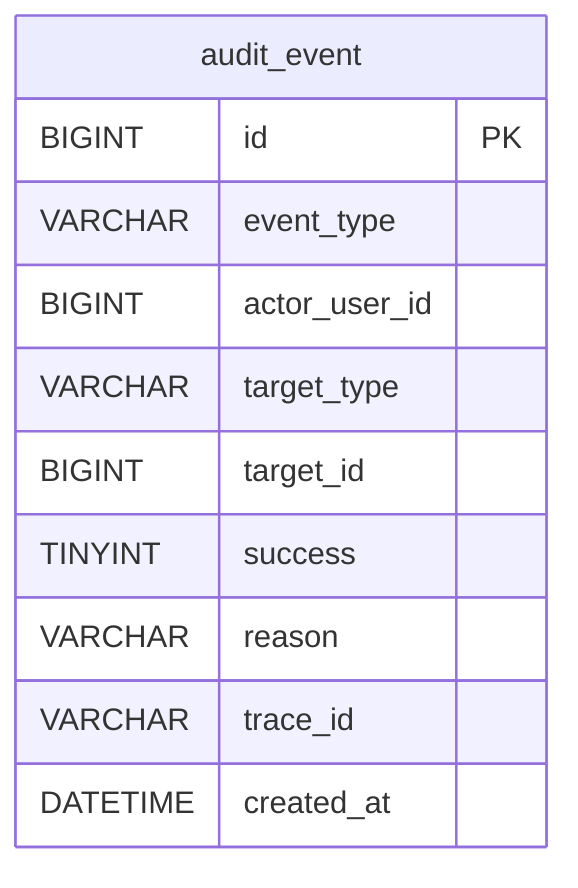

# 数据模型骨架（ER + 核心 DDL）_update_v1

> 数据库：MySQL 8.2  
> DB：freshmart_irs  
> 补充方式：在执行 `01_schema_init.sql` 后，再执行 `01_schema_update_v1.sql`

---

## 1) 变更说明（v1）

- 新增最小化审计事件表 `audit_event`，用于记录账号/角色相关关键操作的审计落库（含 `trace_id`）。
- 为避免牵扯其他表：`actor_user_id/target_id` 仅做“逻辑引用”，不建立外键约束。

---

## 2) ER 图补充（Mermaid erDiagram）



---

## 3) 核心 DDL 补充（MySQL 8.2，freshmart_irs）

```sql
USE freshmart_irs;

SET NAMES utf8mb4;

CREATE TABLE IF NOT EXISTS `audit_event` (
  `id` BIGINT UNSIGNED NOT NULL AUTO_INCREMENT COMMENT 'PK',
  `event_type` VARCHAR(64) NOT NULL COMMENT '事件类型（如 AUTH_LOGIN/USER_REGISTER/USER_UPDATE/USER_DISABLE/PASSWORD_RESET/ROLE_ASSIGN）',
  `actor_user_id` BIGINT UNSIGNED NULL COMMENT '操作者用户ID（逻辑引用 user.id，不建 FK；匿名事件可空）',
  `target_type` VARCHAR(64) NULL COMMENT '目标资源类型（如 USER/ROLE/TOKEN）',
  `target_id` BIGINT UNSIGNED NULL COMMENT '目标资源ID（按 target_type 解释）',
  `success` TINYINT NOT NULL COMMENT '是否成功：1=成功,0=失败',
  `reason` VARCHAR(255) NULL COMMENT '失败原因或补充说明（可空）',
  `trace_id` VARCHAR(64) NOT NULL COMMENT '链路追踪ID（与接口 traceId 对齐）',
  `created_at` DATETIME NOT NULL DEFAULT CURRENT_TIMESTAMP COMMENT '创建时间',
  PRIMARY KEY (`id`),
  KEY `idx_audit_event_trace_id` (`trace_id`),
  KEY `idx_audit_event_actor_user_id` (`actor_user_id`),
  KEY `idx_audit_event_created_at` (`created_at`)
) ENGINE=InnoDB DEFAULT CHARSET=utf8mb4 COLLATE=utf8mb4_0900_ai_ci COMMENT='审计事件（最小化）';
```
